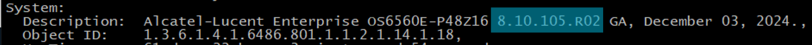

> [!Tip]
> Use `show system` to confirm iOS version
> 

# Pre ver. 8 (OS6400 models)
```
copy running-config working
copy working certified
write memory flash-synchro
```

# Ver 8+ (OS6000 models)
```
copy running certified
copy certified working
write memory flash-synchro
```
</details>
